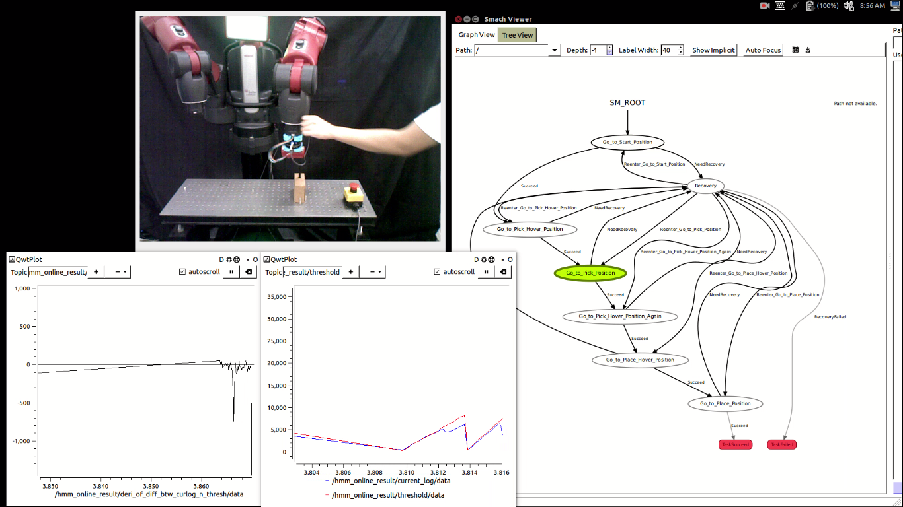

# Online Robot Introspection for Decision Making in Anomaly Recovery

The topic of this project spans the areas of robot introspection, decision making, and anomaly recovery in robot manipulation tasks

Our experimental platform is based on the BAXTER dual-arms robot.
 


## Getting Started

These instructions will get you a copy of the project up and running on your local machine for development and testing purposes. See deployment for notes on how to deploy the project on a live system.

### Prerequisites
1. This proposed method is based on the open source bayesian nonparametric variational infereence library by Mike(http://www.michaelchughes.com). 
2. Basic requirements: 

```
Give examples
```

### Installation
1. git clone this repo
2. make sure the python can import this repo, we should define several environment variables in ~/.bashrc file
```
   #for bnpy 
   export BNPYROOT=~/your_local_path_to/bnpy/
   export PYTHONPATH=${PYTHONPATH}:~/your_local_path_to/bnpy/
   #for saving the results
   export BNPYOUTDIR=~/your_local_path_to/bnpy/results/
   #for the datasets
   export BNPYDATADIR=~/your_local_path_to/bnpy/datasets
```
you can test the correct configuration
```
>> ipython
>> import bnpy
```
## Running the tests

Explain how to run the automated tests for this system

### Break down into end to end tests

Explain what these tests test and why

```
Give an example
```

### And coding style tests

Explain what these tests test and why

```
Give an example
```

## Contributing

Please read [CONTRIBUTING.md](https://gist.github.com/PurpleBooth/b24679402957c63ec426) for details on our code of conduct, and the process for submitting pull requests to us.

## Versioning

We use [SemVer](http://semver.org/) for versioning. For the versions available, see the [tags on this repository](https://github.com/your/project/tags). 

## Authors

* **HongminWu** - *Initial work* - [PurpleBooth](https://github.com/PurpleBooth)

See also the list of [contributors](https://github.com/your/project/contributors) who participated in this project.

## License

This project is licensed under the MIT License - see the [LICENSE.md](LICENSE.md) file for details

## Acknowledgments

* Hat tip to anyone who's code was used
* Inspiration
* etc

## Troubleshoot problems
1. AttributeError:'Process' object has no attribute 'memory_info_ex'

   A: >> emacs /bnpy/bnpy/__init__.py
      >> comment this line: mem_MiB = process.memory_info_ex().rss / float (2 ** 20) and add the following line
         mem_MiB = process.get_memory_info().rss / float (2 ** 20)
